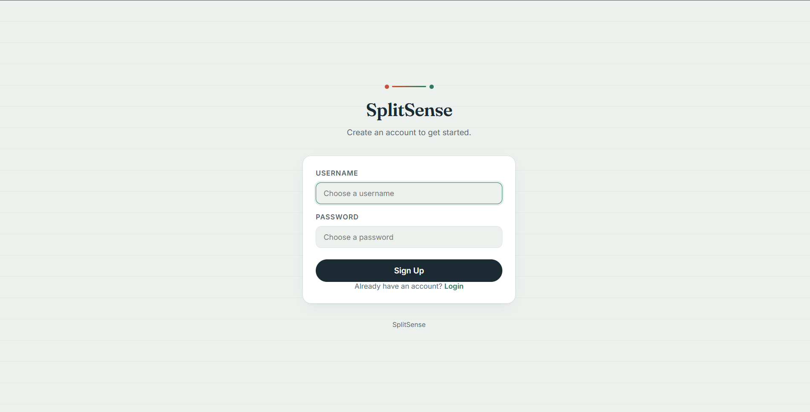
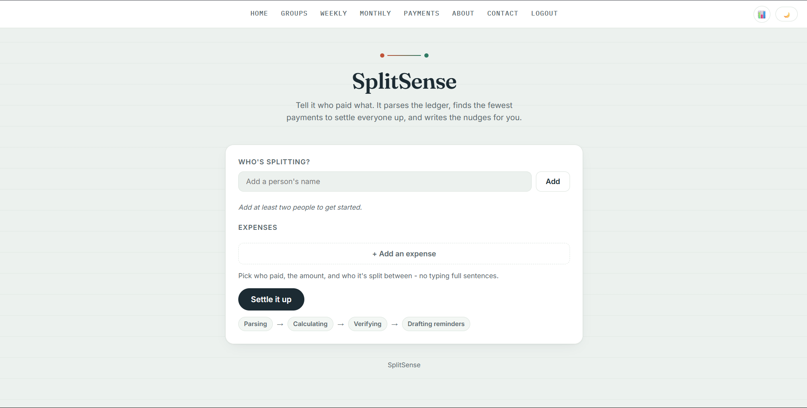
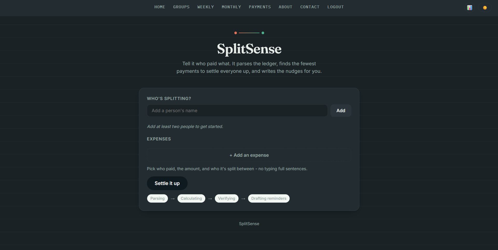
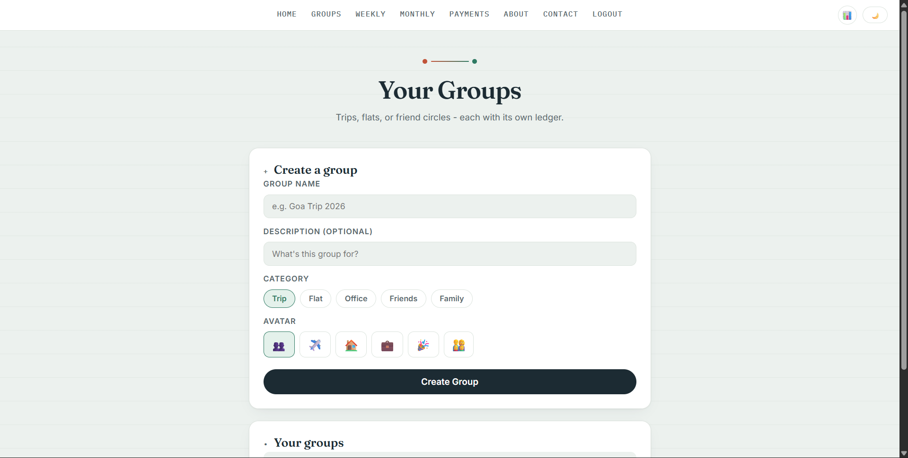
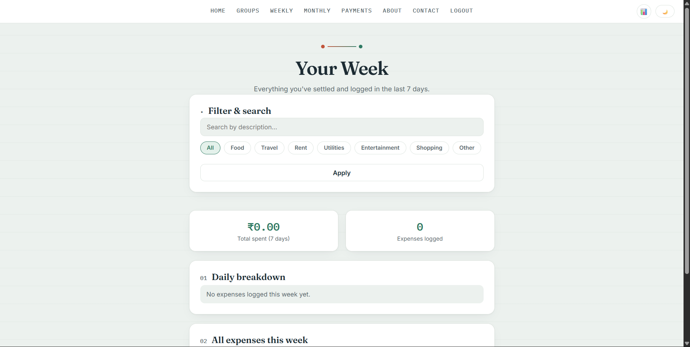
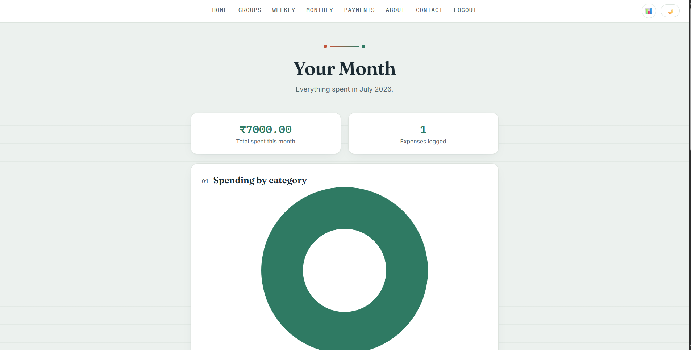
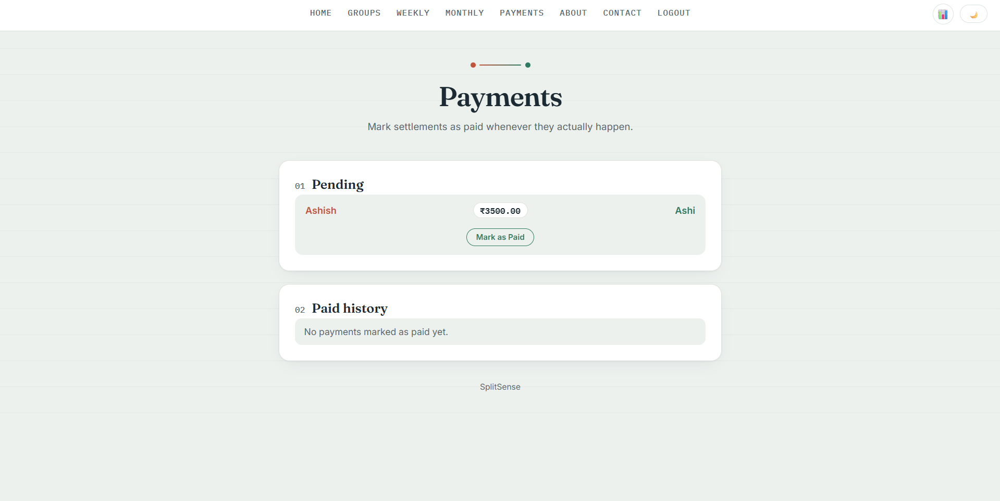
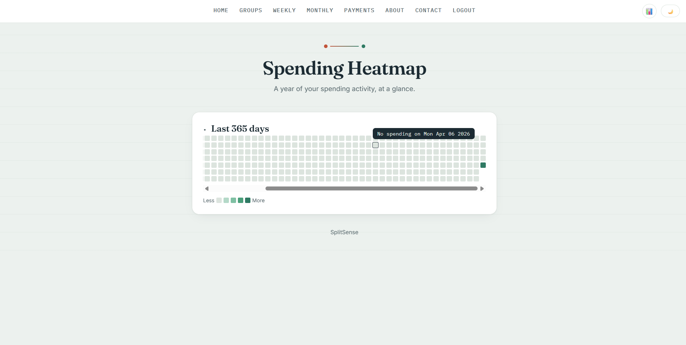

# 💸 SplitSense

🔗 **Live Demo:** [https://splitsense-u71u.onrender.com](https://splitsense-u71u.onrender.com)

SplitSense is an AI-powered expense-settling application for roommates, trips, families, and groups.

Instead of manually calculating who owes whom, users simply describe expenses in plain English, and SplitSense automatically:

- 📝 Extracts structured expense details
- 🧮 Calculates balances
- 💰 Generates the minimum number of transactions
- 💬 Creates friendly reminder messages

---

# ✨ Features

- 🤖 AI-powered expense parsing
- 💵 Minimum transaction settlement algorithm
- 👥 Group management
- 📅 Weekly & Monthly expense tracking
- 📊 Spending analytics
- 🔥 Spending Heatmap
- 🌙 Light & Dark mode
- 📱 Clean responsive UI

---

# 🧠 Agentic 4-Step Pipeline

SplitSense follows a multi-agent workflow instead of relying on a single LLM response.

## Step 1 - LLM Parsing

The user enters expenses in natural language.

Example:

> Raj paid ₹4500 for hotel, split between Raj, Aman and Simran.

The LLM extracts:

- Description
- Paid By
- Amount
- Split Between

If participants are unclear, SplitSense asks for clarification instead of guessing.

---

## Step 2 - Balance Computation

Pure Python performs:

- Balance calculation
- Net amount per user
- Greedy debt simplification

This produces the minimum possible number of payments.

---

## Step 3 - Verification

The settlement is mathematically verified.

Checks include:

- Net balances
- Transaction correctness
- Total money conservation

If verification fails, computation is retried once automatically.

---

## Step 4 - Reminder Generation

The verified settlement is passed back to the LLM to generate friendly reminder messages.

Example:

> Hey Aman! Just a reminder that you owe Raj ₹1500 for the Goa trip 😊

---

# 🏗 Architecture

```
User Input
      │
      ▼
LLM Expense Parser
      │
      ▼
Python Balance Calculator
      │
      ▼
Settlement Verification
      │
      ▼
LLM Reminder Generator
      │
      ▼
Frontend Dashboard
```

---

# 📂 Project Structure

```text
SplitSense/
│
├── app.py                  # Main Flask application
├── models.py               # Database models
├── requirements.txt        # Project dependencies
├── Procfile                # Deployment configuration
├── README.md               # Project documentation
├── .env.example            # Environment variables template
├── .gitignore              # Git ignored files
│
├── assets/                 # Screenshots used in README
│   ├── signup.png
│   ├── home-light.png
│   ├── home-dark.png
│   ├── groups.png
│   ├── weekly.png
│   ├── monthly.png
│   ├── payments.png
│   └── heatmap.png
│
├── static/
│   ├── receipts/           # Uploaded receipt images
│   ├── myphoto.jpg
│   ├── script.js           # Frontend logic
│   ├── style.css           # Application styling
│   └── theme.js            # Light/Dark mode toggle
│
└── templates/
    ├── index.html          # Home page
    ├── signup.html         # User registration
    ├── login.html          # User login
    ├── groups.html         # Group management
    ├── group_detail.html   # Individual group details
    ├── weekly.html         # Weekly analytics
    ├── monthly.html        # Monthly analytics
    ├── payments.html       # Settlement & payments
    ├── heatmap.html        # Spending heatmap
    ├── about.html          # About page
    └── contact.html        # Contact page
```

---

# ⚙ Installation

## Clone Repository

```bash
git clone https://github.com/ashishgupta26012007/splitsense.git
cd splitsense
```

## Create Virtual Environment

```bash
python -m venv venv
```

Windows

```bash
venv\Scripts\activate
```

Linux / macOS

```bash
source venv/bin/activate
```

## Install Dependencies

```bash
pip install -r requirements.txt
```

---

# 🔑 Configure Groq

Create a `.env` file.

```env
GROQ_API_KEY=your_groq_api_key_here
SECRET_KEY=your_flask_secret_key_here
```

---

# ▶ Run

```bash
python app.py
```

Visit

```
http://localhost:5000
```

---

# 📸 Application Screenshots

## 1️⃣ User Registration



Users can quickly create an account by choosing a username and password before accessing SplitSense.

---

## 2️⃣ Home Dashboard

### ☀ Light Theme



The home dashboard allows users to add participants, record expenses, and execute the complete AI-powered settlement pipeline.

### 🌙 Dark Theme



SplitSense also supports Dark Mode for a cleaner and more comfortable user experience.

---

## 3️⃣ Group Management



Create multiple groups for trips, flats, office teams, friends, or family and manage expenses separately.

---

## 4️⃣ Weekly Analytics



Track spending over the last seven days with filters, expense summaries, and category-wise analysis.

---

## 5️⃣ Monthly Dashboard



View monthly spending, category-wise charts, and overall expense statistics.

---

## 6️⃣ Payments



Pending settlements can be marked as paid while maintaining a complete payment history.

---

## 7️⃣ Spending Heatmap



Visualize your spending activity across the past 365 days with an interactive contribution heatmap.

---

# 🛡 Error Handling

SplitSense gracefully handles:

- Missing API key
- Invalid JSON responses
- Network failures
- Model unavailability
- API rate limits
- Timeouts
- Empty or invalid input

---

# 🚀 Tech Stack

### Frontend

- HTML
- CSS
- JavaScript

### Backend

- Python
- Flask

### AI

- Groq API
- Llama Models (via Groq)

### Algorithms

- Greedy Settlement
- Balance Verification

---

# 🌟 Future Improvements

- Authentication
- OCR Receipt Scanner
- Voice Expense Input
- WhatsApp Reminder Integration
- Mobile App
- Real-time Group Collaboration
- Expense Categories with AI Insights

---

# 👨‍💻 Developed By

**Ashish Gupta**

Built as an AI-powered expense settlement application using Flask, OpenRouter, Python, and modern frontend technologies.